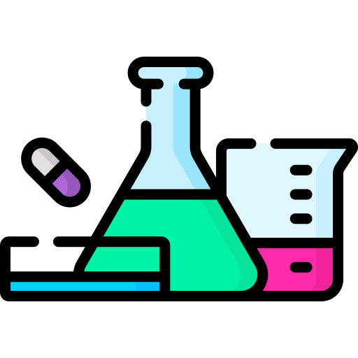
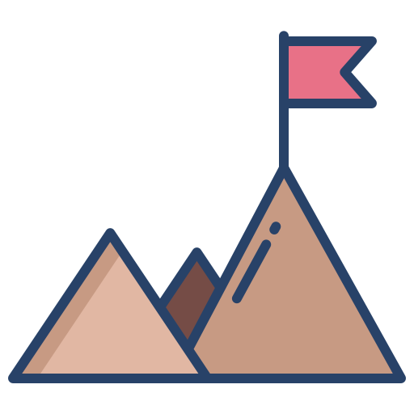

#  Github Stats
   
  

    
     
    <b>Note:</b> Top languages is only a metric of the languages my public code consists of and doesn't reflect experience or skill level.
  

----

#  My Projects
##  Deep Learning:

  
 Click to expand 

📌 [**Dec 2022**]: Diffusion Research and Implementation
  * Research and implement Diffusion on some dataset.
  * [Github Repo](https://github.com/DXL64/diffusion-model.git)
  
📌 [**Dec 2022**]: Resnet Research and Implementation
  * Code and research Resnet with Lightning + Hydra template
  * [Github Repo](https://github.com/DXL64/Resnet.git)
  
📌 [**Jul 2022 - Aug 2022**]: Unet Research and Implementation
  * Code and research Unet algorithm.
  * [Github Repo](https://github.com/DXL64/UNet.git)

📌 [**Feb 2022 - Mar 2022**]: Research about Transformer
  * Research about Transformer and finetuning BERT on downstream tasks:
    * [Question Answering](https://colab.research.google.com/drive/1_FxW1zIzwP6BEqVjdM4a-EtOh7mub75n?usp=sharing)
    * [Vietnamese Sentiment Analysis](https://colab.research.google.com/drive/11YDAMwxvxBVCmEELrI8K8B6EPeeVvOoT?usp=sharing)
    * [English - Vietnamese Translation](https://github.com/hoang1007/transformer-translator.git)
    * [Vietnamese Named Entity Recognition](https://colab.research.google.com/drive/1Co7nBt0R9h8paspo6ENy3sWNou2jjw_7?usp=sharing)

--------
##  Software:

  
Click to expand

  
📌 [**Oct 2022**]:
  * Build mobile application with React Native which manage students in University.
  * [Github Repo](https://github.com/huynhspm/OneUET-Project.git)

--------

#  My Assignments

  
Click to expand

📌 [**May 2021 - Advanced Programming**]:
  * A Dinasour Game with like google chorme game with update graphics using SDL2.
  * [Github Repo](https://github.com/DXL64/FirstProject.git)
	
📌 [**May 2021 - Data Structure and Algorithm**]:
  * A Decision Tree code from scratch with C++.
  * [Github Repo](https://github.com/DXL64/DecisionTree.git)

📌 [**Oct 2021 - Object Oriented Programming**]:
  * A Dictionary App which can translate from speech, image using JavaFx
  * [Github Repo](https://github.com/DXL64/oopuet-dictionary.git)

📌 [**Dec 2021 - Object Oriented Programming**]:
  * A Bomberman Game using JavaFx
  * [Github Repo](https://github.com/DXL64/oop-bomberman.git)

#  Competitions

  
Click to expand

📌 [**Jul 2022 - Sep 2022**]:
  * 5th at Air Quality Forecasting Challenge AI4VN.
  * [Github Repo](https://github.com/hoang1007/air-quality-forecasting/tree/hoangv3)

#  Connect with me

	
	
	
	
	

